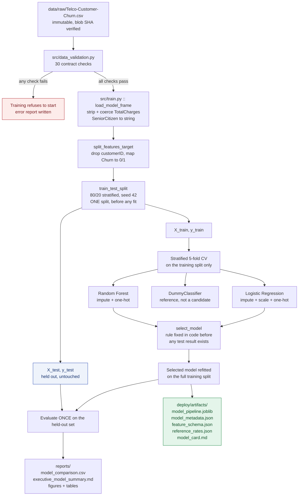
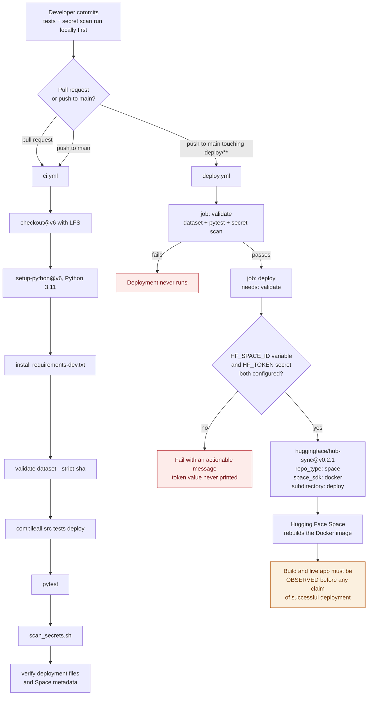

# Architecture

Three flows: how the model is produced, how a prediction is served, and how a change
reaches the deployed application.

---

## 1. Training flow

**The leakage control is structural, not procedural.** Every imputer, encoder and scaler
lives inside the `Pipeline`, so `cross_validate` refits them from scratch on each fold. No
statistic computed on the test split can reach a fitted parameter.

---

## 2. Inference flow

```mermaid
flowchart LR
    subgraph Container["Docker container, non-root, port 7860"]
        direction TB
        S1["app.py starts<br/>NO training at startup"] --> S2["load_artifacts()<br/>@st.cache_resource<br/>loaded once per process"]
        S2 --> S3["feature_schema.json<br/>builds every control"]
    end

    U["Retention specialist"] --> F1["Form: 4 grouped sections<br/>19 predictors"]
    S3 --> F1
    F1 --> F2["Dependency rules enforced<br/>no phone to No phone service<br/>no internet to No internet service"]
    F2 --> F3["Validation<br/>numeric values >= 0<br/>plausibility notes"]
    F3 --> F4["One-row DataFrame<br/>exact training column order"]
    F4 --> P["pipeline.predict_proba"]
    S2 --> P
    P --> R1["Probability"]
    P --> R2["Class at threshold 0.50"]
    R1 --> R3["Risk band<br/>Low / Medium / High"]
    R3 --> R4["Cautious review action"]
    R1 --> C1["Context charts<br/>from reference_rates.json"]
    R4 --> H["HUMAN REVIEW<br/>required before any<br/>customer is contacted"]
    C1 --> H

    style H fill:#fbf0df,stroke:#b45309,color:#6b3406
    style P fill:#eef3fb,stroke:#1e40af,color:#12306e
```

Errors are handled at two points — artifact load and prediction. Both log the technical
detail server-side and show the user a message containing no path, stack frame or internal
identifier.

---

## 3. CI/CD flow

Only `deploy/` is synchronised. Training code, the raw dataset, notebooks, tests and
reports stay in GitHub and never enter the Space.

---

## 4. Repository layout and responsibilities

| Path | Responsibility |
|---|---|
| `data/raw/` | Immutable audited evidence. Never written to. |
| `data/processed/` | Reproducible split exports, for traceability only. Never read back by training. |
| `src/config.py` | Single source of truth for paths, the dataset contract and modelling constants. |
| `src/schemas.py` | The model input contract shared by training and the application. |
| `src/data_validation.py` | 30 contract checks; the gate that training refuses to bypass. |
| `src/eda.py` | Source of truth for every quantitative statement in the report. |
| `src/train.py` | Split, cross-validate, select, evaluate, export. |
| `src/evaluate.py` | Metrics, figures and the executive summary. Reusable without retraining. |
| `deploy/` | Exactly what ships to the Space: app, theme, charts, Dockerfile, artifacts. |
| `tests/` | 52 tests over the data contract, the artifact, prediction behaviour and deployment config. |
| `.github/workflows/` | CI and deployment. |
| `docs/` | Audit trail, decisions, architecture, security, report scaffolding. |

## 5. Boundaries deliberately drawn

- **`deploy/` never imports `src/`.** A test enforces it. The container carries no training
  code, so the image stays small and the deployed surface is minimal.
- **`data/raw/` is written by nothing.** Validation reads it; EDA and training copy from it.
- **The application never trains.** It loads one artifact and scores one row.
- **The model never acts.** It returns a number, a band and a suggestion; a person decides.
