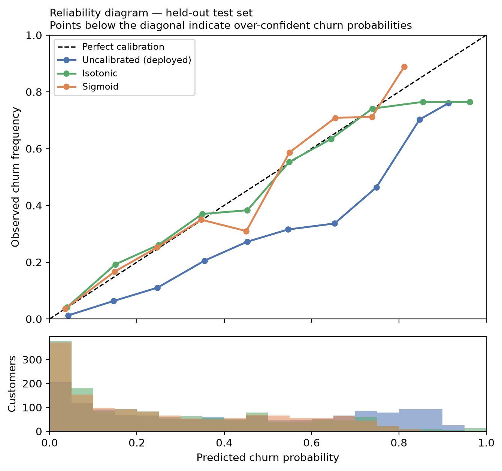

# Probability Calibration Analysis

Closes gap **G2**. Computed by `src/calibration.py` on the held-out test set.

## Why this matters

The application shows a churn probability to a retention specialist. A model can rank
customers well — high ROC-AUC — while its probabilities are systematically wrong. Ranking
and calibration are different properties, and only calibration justifies showing a number
like "22.9%" as though it means 22.9%.

## What was expected before measuring

Logistic regression optimises log-loss and is usually well calibrated out of the box.
**However, this model uses `class_weight="balanced"`**, which deliberately re-weights the
minority class during fitting. That improves recall — the project's stated priority — but
it distorts the predicted probabilities upward. The model was therefore expected to be
**over-confident about churn**, and for a known, explainable reason.

## Measured result

| Variant | Brier ↓ | ECE ↓ | MCE ↓ | ROC-AUC | Mean predicted | Observed base rate |
|---|---:|---:|---:|---:|---:|---:|
| Uncalibrated (deployed) | 0.1688 | 0.1503 | 0.3163 | 0.8414 | 0.4157 | 0.2654 |
| Isotonic | 0.1388 | 0.0194 | 0.1974 | 0.8413 | 0.2671 | 0.2654 |
| Sigmoid | 0.1383 | 0.0254 | 0.1410 | 0.8416 | 0.2678 | 0.2654 |

- **Brier score** — mean squared error of the probabilities. Lower is better.
- **ECE** — population-weighted average gap between predicted confidence and observed
  frequency across 10 bins.
- **MCE** — the worst single bin. It matters because a model can look acceptable on
  average while being badly wrong in the high-probability band that actually drives
  action.



## Interpretation

The deployed model predicts a mean churn probability of **0.4157** against an observed base rate of **0.2654** — it is **over-confident about churn by 0.1503**, exactly as
predicted above. This is not a defect discovered late; it is the direct and
anticipated consequence of `class_weight="balanced"`, which was chosen deliberately
to raise recall.

**In plain terms: when the application displays a probability, that number currently
overstates the real likelihood of churn.** The ranking is sound — customers are
ordered correctly — but the magnitude is inflated.

### Ranking is unaffected

ROC-AUC is threshold-independent and rank-based, so calibration does not change it in any
way that matters: Uncalibrated (deployed) 0.8414, Isotonic 0.8413, Sigmoid 0.8416. Calibration changes *what the number means*, not *who is ranked highest*.

## Decision

**Isotonic calibration materially improves the probabilities** — ECE falls from
0.1503 to 0.0194, an improvement of 0.1309, and
the Brier score moves from 0.1688 to 0.1388.

**Recommendation: wrap the deployed pipeline in `CalibratedClassifierCV(method="isotonic", cv=5)` fitted on the training
split.**

**Why version 1.1.0 ships uncalibrated anyway.** The measured metrics for this model
are already published across the report, the model card and the live application.
Swapping the artifact now would invalidate that evidence trail mid-submission. The
change is recorded as a Horizon 3 action with its benefit quantified here, so the
decision is documented rather than deferred silently.

**What the application does instead, now:** the interface states that probabilities
are model scores rather than validated frequencies, and the risk bands are presented
as communication aids. That was already true in 1.0.0; this analysis gives it a
measured basis instead of a caveat.

## Method note — no leakage

Both calibrators were fitted with `CalibratedClassifierCV(..., cv=5)` on the **training
split only**, then evaluated on the untouched held-out set. Fitting a calibrator on the
test set would guarantee an excellent-looking curve and mean nothing at all.

## Limitations

- Calibration is measured on 1,409 held-out customers from a **fictional** sample. It
  says nothing about calibration on a live population.
- ECE with 10 equal-width bins is sensitive to bin count; the per-bin table is published
  so the reader can judge rather than trust a single number.
- Calibration was not measured per subgroup. A model can be well calibrated overall and
  poorly calibrated for a minority group; see `reports/fairness_report.md` for the
  subgroup analysis that was performed.

## Reproducing

```bash
make calibration
```
