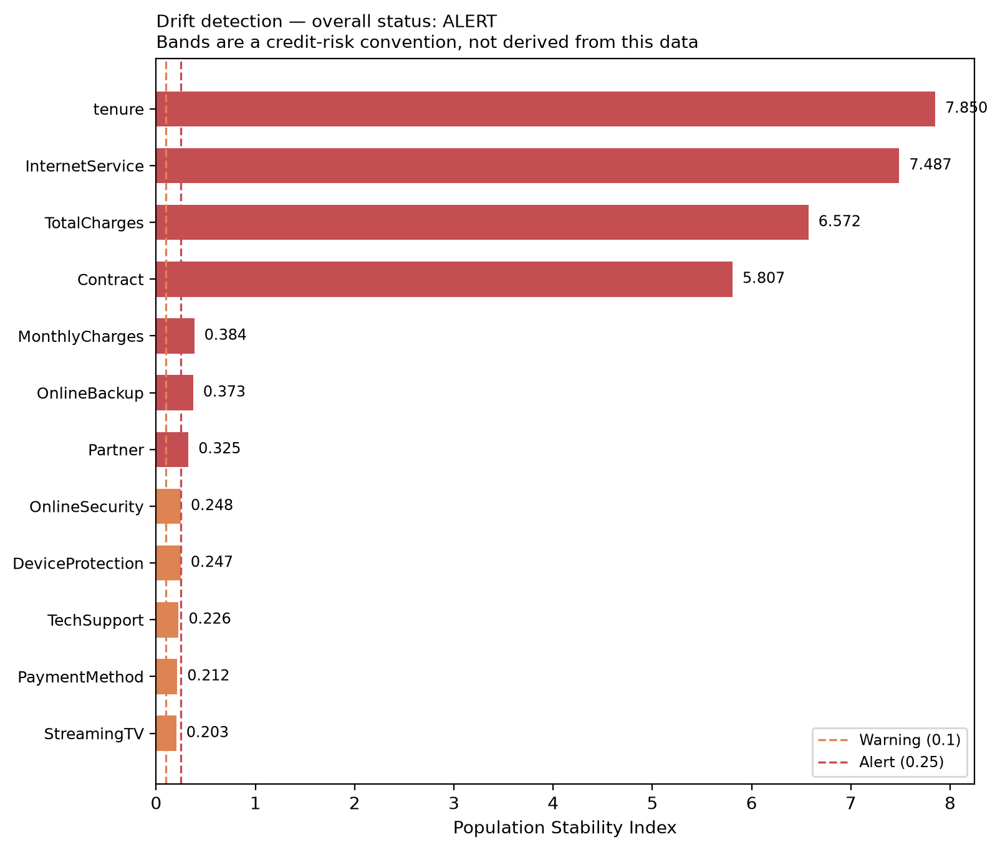

# Drift Detection

Closes gap **G6**. Produced by `src/drift.py`.

## What this is, and what it is not

**This project cannot detect real drift.** The IBM sample is a single cross-section
with no time dimension, so there is no later distribution to compare against. Claiming
to *monitor* drift here would be false.

What has been built is the **apparatus**: a persisted baseline profile of the training
population, two detectors, and a demonstration that they fire on a deliberately shifted
sample and stay quiet on an unshifted one. A detector never shown to fire is not
evidence of anything — the same standard this project applied to its secret scanner.

## Method

| Component | Approach |
|---|---|
| Baseline | Training split only, profiled into quantile bins and category frequencies |
| Numeric detector | Population Stability Index over baseline deciles |
| Categorical detector | PSI over category frequencies, plus a chi-squared goodness-of-fit test |
| Bands | PSI < 0.1 stable · 0.1–0.25 warning · > 0.25 alert |

The PSI bands are a **credit-risk industry convention**, not a threshold derived from
this data. They are reported as such wherever they appear.

Quantile bins are used rather than equal-width bins because `TotalCharges` and `tenure`
are strongly skewed; equal-width binning would place most of the mass in one bin and
make PSI insensitive to exactly the shifts worth catching.

### Why not Evidently

`evidently` was evaluated and rejected. It brings a substantial transitive dependency
tree for two detectors implemented here in a few dozen lines, and the team could not
defend its internals under questioning. The dependency cost exceeded the benefit.

## Demonstration

### Control — held-out test set against the training baseline

- Features checked: **19**
- Flagged: **0**
- Overall status: **STABLE**

The held-out set is drawn from the same population as the training split, so a correct
detector should report stability here. It does. This is the false-positive check.

### Shifted — simulated acquisition campaign

A deliberately shifted population was constructed: mostly new month-to-month fibre
customers, as an acquisition campaign would produce. The shift moves `Contract`,
`InternetService` and `tenure` together, which is what real drift looks like — unlike
random noise, which moves nothing systematically.

- Features checked: **19**
- Flagged: **15**
- At alert level: **7**
- Overall status: **ALERT**

| Feature | Kind | PSI | Status |
|---|---|---:|---|
| `tenure` | numeric | 7.8496 | **alert** |
| `InternetService` | categorical | 7.4872 | **alert** |
| `TotalCharges` | numeric | 6.5720 | **alert** |
| `Contract` | categorical | 5.8073 | **alert** |
| `MonthlyCharges` | numeric | 0.3844 | **alert** |
| `OnlineBackup` | categorical | 0.3727 | **alert** |
| `Partner` | categorical | 0.3250 | **alert** |
| `OnlineSecurity` | categorical | 0.2481 | **warning** |
| `DeviceProtection` | categorical | 0.2471 | **warning** |
| `TechSupport` | categorical | 0.2260 | **warning** |



## Verdict

**The detector is validated.** It reports `stable` on an unshifted sample and
`alert` on a shifted one. Both halves matter: a detector that always fires is as
useless as one that never does.

## How this would be used in production

1. Score a batch of live customers.
2. Run `detect_drift()` against the persisted baseline.
3. On `warning`, log and review at the next model-risk meeting.
4. On `alert`, block automated use and require human revalidation before the model
   continues to inform prioritisation.
5. Retrain only when drift is confirmed *and* labelled outcomes are available —
   retraining on drifted but unlabelled data would encode the drift rather than correct
   it.

## Limitations

- **No real drift has been observed.** Everything here is apparatus and simulation.
- PSI detects distribution change, not performance decay. A feature can shift without
  harming accuracy, and accuracy can decay with no feature shift at all (concept drift).
- Detecting **concept** drift needs outcome labels, which arrive only after customers
  have actually churned. That lag is a property of the problem, not of this design.
- The chi-squared test is sensitive at large sample sizes: with enough rows, trivial
  differences become significant. That is why PSI, not the p-value, governs the status.

## Reproducing

```bash
make drift
```
