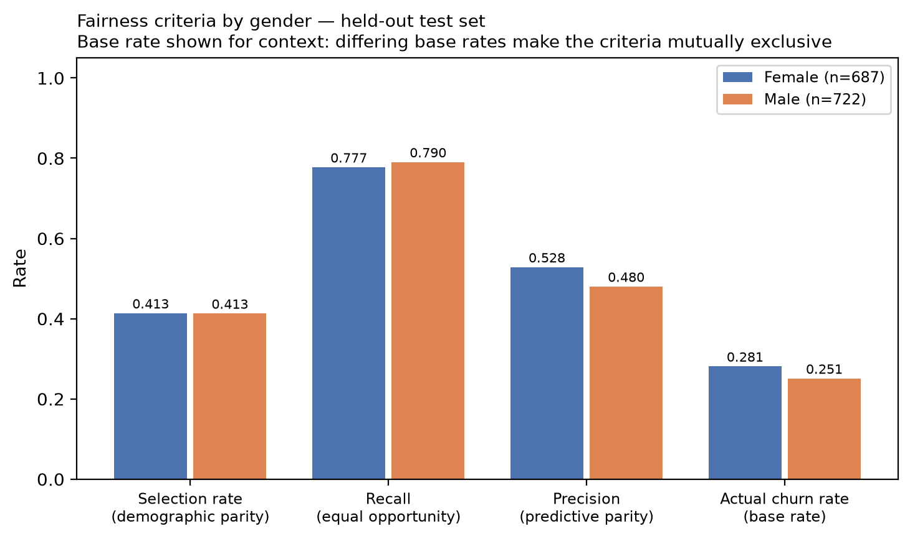
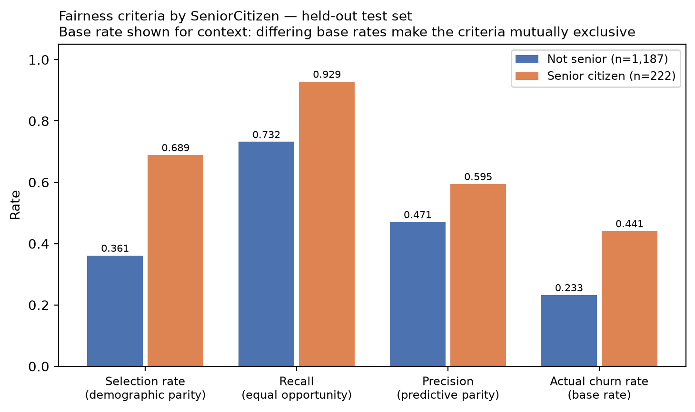

# Fairness Audit

Closes gap **G1**. Computed by `src/fairness.py` on the held-out test set at a
decision threshold of 0.50. Every number is computed;
none is hand-entered.

## Why this audit exists

`gender` and `SeniorCitizen` are model predictors. Version 1.0.0 of this project
documented the absence of a fairness audit as a known limitation and stated that one
was required before operational use. This is that audit.

## The three criteria, and why they cannot all hold

| Criterion | Question it asks | Equalises |
|---|---|---|
| Demographic parity | Are groups flagged at the same rate? | Selection rate |
| Equal opportunity | Are at-risk customers found equally well in each group? | Recall (TPR) |
| Predictive parity | Is a flag equally trustworthy for each group? | Precision (PPV) |

These are **mathematically incompatible** whenever the groups have different actual
churn rates, which is why the base rate is reported alongside them. Satisfying all
three simultaneously is impossible, so a choice must be made and justified.

**This project optimises for equal opportunity.** The model's purpose is to find
at-risk customers so a specialist can review them. The harm that matters is a customer
being missed — receiving no retention review — and that harm should not fall more
heavily on one group. Demographic parity would be the wrong target here: if one group
genuinely churns more, forcing equal flag rates would systematically under-serve it.

Disparities above **0.10** are reported as material. That is a
practitioner convention, not a value derived from this data. The four-fifths ratio
screen (0.80) from US EEOC guidance is reported as a secondary reference point, not as
a legal test — this is a fictional dataset and no legal conclusion follows from it.

## gender

| Group | n | Actual churn rate | Selection rate | Recall | Precision | FPR | Accuracy |
|---|---:|---:|---:|---:|---:|---:|---:|
| Female | 687 | 0.2809 | 0.4134 | 0.7772 | 0.5282 | 0.2713 | 0.7424 |
| Male | 722 | 0.2507 | 0.4127 | 0.7901 | 0.4799 | 0.2865 | 0.7327 |

Confusion matrix per group:

| Group | TN | FP | FN | TP |
|---|---:|---:|---:|---:|
| Female | 360 | 134 | 43 | 150 |
| Male | 386 | 155 | 38 | 143 |

### Disparities

| Criterion | Max | Min | Gap | Ratio (min/max) | Material? | Passes 4/5 screen |
|---|---:|---:|---:|---:|---|---|
| demographic parity | 0.4134 | 0.4127 | 0.0006 | 0.9984 | no | yes |
| equal opportunity | 0.7901 | 0.7772 | 0.0129 | 0.9837 | no | yes |
| predictive parity | 0.5282 | 0.4799 | 0.0483 | 0.9085 | no | yes |
| false positive rate | 0.2865 | 0.2713 | 0.0153 | 0.9468 | no | yes |

Actual churn rate differs between groups by 0.0302 (0.2507 to 0.2809). This is a property of the sample, not of
the model, and it is the reason the three criteria cannot all be satisfied.



## SeniorCitizen

| Group | n | Actual churn rate | Selection rate | Recall | Precision | FPR | Accuracy |
|---|---:|---:|---:|---:|---:|---:|---:|
| Not senior | 1,187 | 0.2325 | 0.3614 | 0.7319 | 0.4709 | 0.2492 | 0.7464 |
| Senior citizen | 222 | 0.4414 | 0.6892 | 0.9286 | 0.5948 | 0.5000 | 0.6892 |

Confusion matrix per group:

| Group | TN | FP | FN | TP |
|---|---:|---:|---:|---:|
| Not senior | 684 | 227 | 74 | 202 |
| Senior citizen | 62 | 62 | 7 | 91 |

### Disparities

| Criterion | Max | Min | Gap | Ratio (min/max) | Material? | Passes 4/5 screen |
|---|---:|---:|---:|---:|---|---|
| demographic parity | 0.6892 | 0.3614 | 0.3278 | 0.5244 | **YES** | **NO** |
| equal opportunity | 0.9286 | 0.7319 | 0.1967 | 0.7882 | **YES** | **NO** |
| predictive parity | 0.5948 | 0.4709 | 0.1239 | 0.7917 | **YES** | **NO** |
| false positive rate | 0.5000 | 0.2492 | 0.2508 | 0.4984 | **YES** | **NO** |

Actual churn rate differs between groups by 0.2089 (0.2325 to 0.4414). This is a property of the sample, not of
the model, and it is the reason the three criteria cannot all be satisfied.



## Finding

### gender — no material disparity

Every criterion for `gender` fell below the 0.10
materiality convention. This is a genuine measured result, not an absence of one.
It does not mean the model is fair in any absolute sense — only that on this
attribute, at this threshold, on this fictional sample, no material disparity was
found.

### SeniorCitizen — material disparity, and what actually drives it

Criteria exceeding the convention: `demographic parity`, `equal opportunity`, `predictive parity`, `false positive rate`.

**The disparity must not be read as the model disadvantaging the minority group.**
The two groups have genuinely different churn rates in the sample: **Senior citizen 0.4414** against **Not senior 0.2325**, a gap of 0.2089. Three consequences follow, and they point in
different directions:

1. **Selection rate** — Senior citizen customers are flagged more often (0.6892 against 0.3614). Given the
   base-rate difference this is the model behaving *correctly*, not unfairly.
   Forcing demographic parity here would mean deliberately under-flagging the group
   that actually churns more — worse service, not fairer service.
2. **Recall** — the model finds at-risk Senior citizen customers *better* (0.9286 against 0.7319). On the criterion this
   project optimises for, the group being under-served is **Not senior**, not
   Senior citizen. That is the opposite of the usual assumption and is the most
   important line in this audit.
3. **False positive rate** — Senior citizen customers who would have stayed are
   flagged far more often (0.5000 against 0.2492). **This is the real burden.** It does not cost
   the customer a missed review; it costs them unnecessary contact. Whether that is
   acceptable is a business and ethics judgement, not a modelling one.

## Decision

The keep-or-remove decision was made **after measuring the cost of removal**, not
before. The model was retrained with `gender` and `SeniorCitizen` dropped entirely:

| Metric | With attributes | Without | Cost of removal |
|---|---:|---:|---:|
| ROC-AUC | 0.8414 | 0.8406 | +0.0008 |
| Recall | 0.7834 | 0.7807 | +0.0027 |
| F1 | 0.6130 | 0.6102 | +0.0027 |

**The attributes contribute almost nothing to predictive performance.** Removing
both costs +0.0008 ROC-AUC and +0.0027 recall — differences
well inside the cross-validation standard deviation of ±0.0124 reported in
`reports/model_comparison.csv`, and therefore not distinguishable from noise.

**Recommendation: remove both attributes before any operational use.**

The reasoning is straightforward. The attributes buy no measurable accuracy, they
introduce a demographic disparity that must then be explained and defended, and
retaining a protected characteristic that earns nothing is an unforced governance
risk. When the trade-off is *no benefit* against *real explanatory burden*, the
decision is not finely balanced.

**Why they are retained in version 1.1.0 anyway:** this is an academic submission
whose measured results are already published across the report, the model card and
the deployed application. Silently changing the model now would invalidate that
evidence trail. The recommendation is recorded as the first action of Horizon 3,
with the cost quantified, so the decision is documented rather than deferred by
omission. In a production setting with no such constraint, the attributes would
be removed now.

### Options considered

| Option | Assessment |
|---|---|
| (a) Remove the protected attributes | **Recommended.** Cost measured above. |
| (b) Retain and document the disparity | Applied to version 1.1.0 to preserve the published evidence trail; documented, not silent. |
| (c) Apply a group-specific decision threshold | **Rejected outright.** Setting a different threshold per protected characteristic is direct differential treatment. It would improve a fairness statistic while creating a discrimination exposure. This rejection stands regardless of what the numbers show. |

Option (c) is recorded because rejecting it is a substantive decision, not an omission.

## Limitations of this audit

- The dataset is **fictional**. No conclusion about real-world discrimination follows.
- Only two attributes with two levels each were audited. `Partner`, `Dependents` and
  tenure-related proxies could encode further group structure and were not examined.
- **Intersectional effects were not tested** — for example senior women as a distinct
  group. Sample sizes in the held-out set would be too small for a stable estimate.
- The audit measures the model at one threshold. A different operating point would give
  different disparities; see `reports/threshold_analysis.md`.
- Fairness of the *outcome* depends on what humans do with the score. This audit covers
  the model only, not the retention process built around it.

## Reproducing

```bash
make fairness
```
