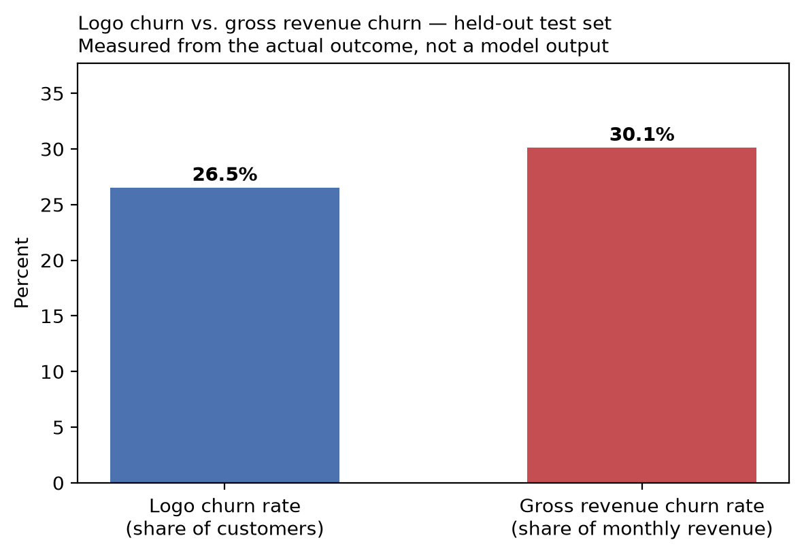

# Revenue-Weighted Churn Metrics

Computed by `src/revenue.py` on the held-out test set. A retention team does not
experience every departure equally — this splits the standard **logo churn** figure
from its **revenue-weighted** counterpart and reports a **model-based revenue exposure**
for the accounts the deployed threshold currently flags.

## Measured (retrospective, from the actual test-set outcome)

| Metric | Value |
|---|---:|
| Test-set customers | 1,409 |
| Logo churn rate | 0.2654 |
| Total monthly revenue in the test set | $90,301.20 |
| Monthly revenue attached to churned customers | $27,214.90 |
| **Gross revenue churn rate** | **0.3014** |

Gross revenue churn is **0.0359 above** logo churn — churned customers
are not a representative cross-section of the account book by spend. See the segment
reference rates for which contract types drive this.



## Net revenue churn — not computable

**Net revenue churn cannot be measured from this dataset**, and no substitute figure is
reported in its place. It requires an expansion/contraction/reactivation revenue series —
upgrades, downgrades and win-backs tracked across periods — and this project has exactly
one fictional cross-section with no time dimension. This is the same constraint already
documented for drift detection in `reports/drift_report.md`: the honest response to a
metric the data cannot support is to say so, not to approximate it.

## Prospective (model-based revenue exposure at the deployed threshold)

At the decision threshold of **0.50**:

| Metric | Value |
|---|---:|
| Customers flagged | 582 (41.3% of the test set) |
| Monthly revenue flagged | $44,301.85 (49.1% of test-set revenue) |
| **Total expected revenue at risk** (whole test set) | **$1,313,910.01** |
| Expected revenue at risk (flagged accounts only) | $1,097,814.24 |

The flagged group holds **1.19x** the revenue share its customer share would imply, meaning the model's review queue is weighted toward higher-spend accounts than a random sample of the same size would be.

**Expected revenue at risk** multiplies, per customer: the model's churn probability x
`MonthlyCharges` x an expected-remaining-tenure figure from the Kaplan-Meier survival
curves in `reports/survival_report.md`. It is a transparent combination of three
already-disclosed numbers, offered to help prioritise a review queue by commercial
stake rather than probability alone. **It is not a forecast of realised loss and no
return on any retention action has been measured.**

## Limitations

- Measured figures describe the **fictional** IBM sample's held-out test set, not a live
  population.
- Expected revenue at risk depends on the survival curves' own limitations (single
  cross-section, `Contract`-only stratification) — see `reports/survival_report.md`.
- No customer-level financial outcome has been validated against this exposure figure;
  it is arithmetic on disclosed numbers, not a measured return.

## Reproducing

```bash
make survival
make revenue
```
