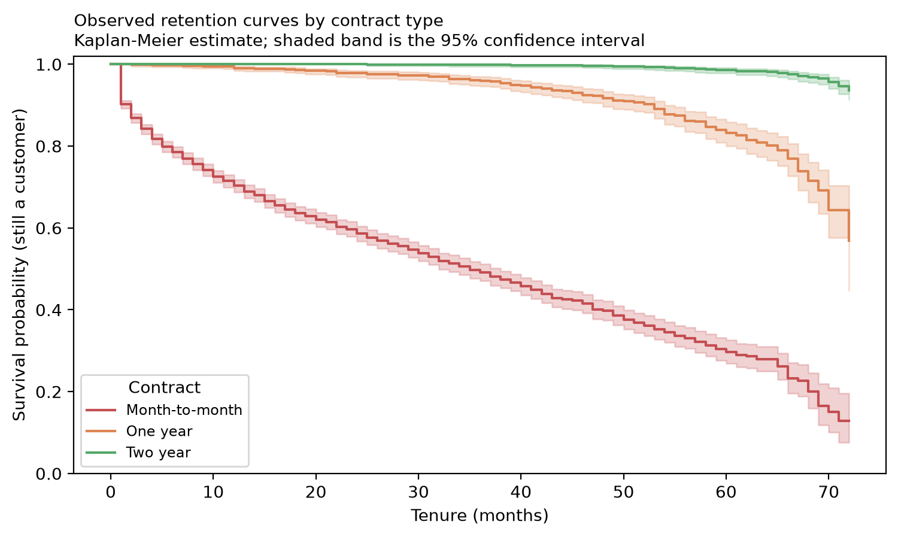

# Survival Analysis — Time to Churn by Contract

Computed by `src/survival.py` on the full validated dataset. Extends the point-in-time churn probability into an estimate of **when** a customer of a given contract type tends to leave, and how much commercial life remains for one who has already reached a given tenure.

## Method

- **Duration** — `tenure` (months with the company).
- **Event** — `Churn == 'Yes'` is an observed event at that tenure. `Churn == 'No'` is   **right-censored**: the customer was known to be active for at least that many   months, with no further information.
- One Kaplan-Meier curve fitted per `Contract` level.
- Fitted on the **full validated dataset**, not the train/test split used elsewhere.   This module describes observed data, not the classifier's predictions, so the split   that protects against leakage into a model has no equivalent requirement here.

## Are the three curves actually different?

Multivariate log-rank test across the three `Contract` groups: statistic **2352.87**, p-value **0.00e+00**. The curves differ far beyond what sampling noise would produce — consistent with the EDA finding that `Contract` is the strongest single correlate of churn.



## Segment summary

| Contract | n | Events observed | Median survival (months) | Restricted mean survival to 72 months |
|---|---:|---:|---:|---:|
| Month-to-month | 3,875 | 1,655 | 35 | 36.3 |
| One year | 1,473 | 166 | not reached | 66.4 |
| Two year | 1,695 | 48 | not reached | 71.5 |

**Median survival** is the tenure at which half the segment has churned. For One year
and Two year contracts the curve never falls below 50% inside the observed horizon, so
the median is reported as "not reached" rather than a fabricated number — the
**restricted mean survival time** (area under the curve up to the horizon) is used
instead, which is well-defined for every segment.

## From a curve to a number: expected remaining tenure

The step function behind each curve is condensed into a discrete restricted-mean
residual-life estimate:

```
E[remaining months | survived to t0] ~= sum_{u=t0+1..tau} S(u) / S(t0)
```

floored at **1 month** so a customer already at the horizon
is not assigned zero remaining value. This is the figure `deploy/valuation.py` multiplies
by the churn probability and `MonthlyCharges` to produce the revenue-at-risk estimate
shown in the application — see `reports/revenue_churn_report.md`.

## Limitations

- This is a **single cross-section**: every customer was observed once, at their
  current tenure. There is no way to distinguish a genuine plateau in the hazard from an
  artefact of how long the company itself has existed.
- Values beyond a segment's own last observed duration are **held forward** from the
  last computed point (a lifelines convention for step-function survival curves), which
  is an extrapolation, not an additional observation.
- Contract type is the only stratification variable. A customer's true residual life
  almost certainly also depends on tenure-independent attributes (`InternetService`,
  `TechSupport`) not modelled here — this analysis trades that resolution for a stable,
  legible lookup table with enough events per stratum to fit reliably.
- This describes the fictional IBM sample. No claim is made about a live population.

## Reproducing

```bash
make survival
```
