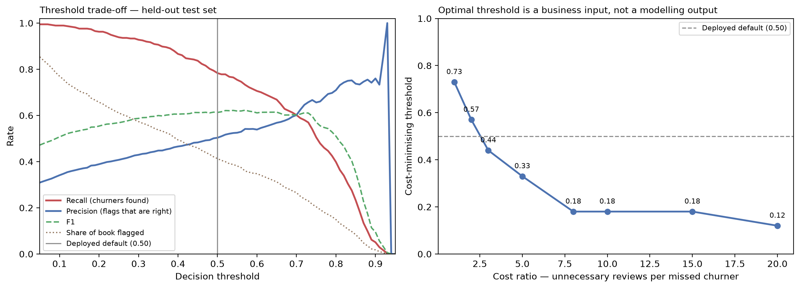

# Decision Threshold Analysis

Closes gap **G3**. Computed by `src/threshold.py` on the held-out test set
(1,409 customers).

## The question this answers

Version 1.0.0 used a decision threshold of 0.50 and documented it honestly as "a
documented default, not an optimised operating point". *Why 0.50?* had no better answer
than *because it is the default*.

## Why no single number is given

The optimal threshold depends entirely on one business quantity: **how many unnecessary
reviews is one missed churner worth?** That is a commercial judgement about the cost of
a lost customer against the cost of a specialist's time. It was never supplied, and
inventing a currency figure would be fabricating a business claim.

So instead of guessing, this analysis publishes the whole sensitivity curve. Only the
*ratio* matters, not the absolute costs, which is precisely why no currency needs to be
invented:

```
Cost(t) = FN(t) × C_miss + FP(t) × C_review        [set C_review = 1]
        = FN(t) × ratio  + FP(t)
```

**The business supplies the ratio. The model supplies the curve.**

## Optimal threshold by cost ratio

| Cost ratio | Optimal threshold | Recall | Precision | Flagged | Missed churners |
|---:|---:|---:|---:|---:|---:|
| 1:1 | **0.73** | 0.5695 | 0.6574 | 324 (23.0%) | 161 |
| 2:1 | **0.57** | 0.7326 | 0.5415 | 506 (35.9%) | 100 |
| 3:1 | **0.44** | 0.8422 | 0.4817 | 654 (46.4%) | 59 |
| 5:1 | **0.33** | 0.9171 | 0.4403 | 779 (55.3%) | 31 |
| 8:1 | **0.18** | 0.9733 | 0.3828 | 951 (67.5%) | 10 |
| 10:1 | **0.18** | 0.9733 | 0.3828 | 951 (67.5%) | 10 |
| 15:1 | **0.18** | 0.9733 | 0.3828 | 951 (67.5%) | 10 |
| 20:1 | **0.12** | 0.9866 | 0.3545 | 1,041 (73.9%) | 5 |



## Reading the table

- At **1:1** — a missed churner costs the same as one unnecessary review — the optimum
  is 0.73. The model flags 324 customers
  (23.0% of the book) and misses 161.
- At **5:1** the optimum moves to 0.33: recall rises to
  0.9171 and the review workload grows to 55.3%.
- At **20:1** — a lost customer is very expensive relative to a review — the optimum is
  0.12, catching 98.7% of churners while
  flagging 73.9% of the book.

The direction is intuitive and worth stating plainly: **the more a lost customer costs
relative to a review, the lower the threshold should go** — you accept more false alarms
to avoid missing anyone.

## Where the deployed default sits

| Operating point | Threshold | Recall | Precision | F1 | Flagged | Missed |
|---|---:|---:|---:|---:|---:|---:|
| **Deployed default** | 0.50 | 0.7834 | 0.5034 | 0.6130 | 582 | 81 |
| F1-maximising | 0.57 | 0.7326 | 0.5415 | 0.6227 | 506 | 100 |

The deployed 0.50 threshold is cost-optimal at a ratio of approximately **3:1**. In other words, using 0.50 is an
implicit assertion that one missed churner is worth about that many unnecessary reviews.
Stating the assumption is the point: the number was always there, it was simply never
made explicit.

## Recommendation

1. **Ask the business for the ratio.** One question — *how many unnecessary retention
   reviews would you trade for catching one more churner?* — resolves the threshold
   entirely. Most retention functions land between 3:1 and 10:1.
2. **Until that answer exists, keep 0.50** and label it as an assumption rather than an
   optimum. That is what the application now does.
3. **Expose the threshold in the interface** so the sensitivity is visible rather than
   buried in a report. The application now provides an adjustable threshold control,
   defaulting to 0.50, with the risk bands and outputs recomputing live.

## Limitations

- The curve is computed on 1,409 held-out customers from a **fictional** sample. The
  shape is informative; the exact optima are not precise to two decimal places.
- Costs are assumed constant per customer. In reality the value of a retained customer
  varies with tenure, contract and monthly charges — a per-customer cost model would be
  a genuine improvement and is out of scope here.
- The analysis assumes the probabilities rank customers correctly. It does **not** assume
  they are calibrated; see `reports/calibration_report.md`, which shows they are not.
- No account is taken of intervention effectiveness. A flagged customer who is contacted
  may still churn; nothing here measures whether retention actions work.

## Reproducing

```bash
make threshold
```
