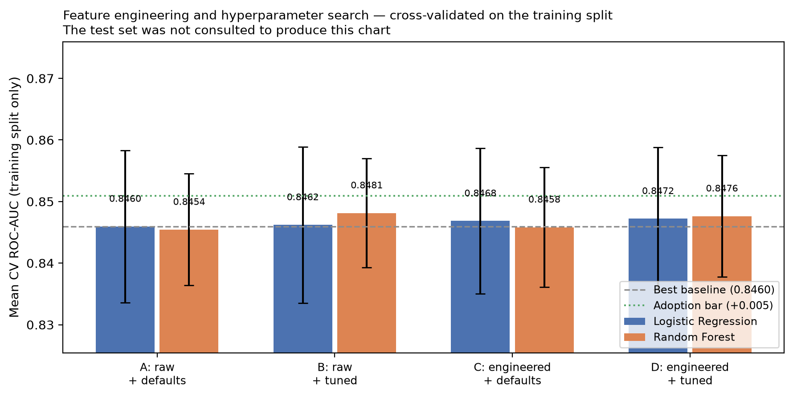

# Feature Engineering and Hyperparameter Search

Produced by `src/tuning.py`. Answers one question: **do engineered features and tuned
hyperparameters actually improve this model?**

## Method, and why it is constrained

The held-out test set had already been scored once for version 1.1.0, and those metrics
are published. Using it again to choose between model versions would turn it into a
selection set and quietly invalidate the guarantee the project rests on.

So **every decision here — which features, which hyperparameters, whether to adopt any
of it — was made by cross-validation on the training split alone.** The test set is
scored once at the end, and only to report what the chosen model achieves.

Four arms, so the contribution of each change is separable rather than confounded:

| Arm | Features | Hyperparameters |
|---|---|---|
| A | Raw 19 | Hand-set (the deployed v1.1.0 model) |
| B | Raw 19 | Grid-searched |
| C | Raw 19 + 7 engineered | Hand-set |
| D | Raw 19 + 7 engineered | Grid-searched |

## Engineered features

Seven, all **stateless row-wise functions** of a single customer's own values. Nothing
is aggregated across rows and nothing is fitted, so no information can pass between
splits. They live **inside the pipeline**, so the application still passes the 19 raw
columns and the artifact stays self-contained.

| Feature | Definition | Why |
|---|---|---|
| `AvgMonthlySpend` | TotalCharges / max(tenure, 1) | The customer's realised average bill. Differs from MonthlyCharges whenever pricing or the package has changed. |
| `ChargesTrend` | MonthlyCharges / AvgMonthlySpend | Above 1 means the customer now pays more than their historical average. The raw columns hold levels; this is the only feature expressing change. |
| `NumServices` | Count of the 8 service columns equal to 'Yes' | How embedded the customer is in the product set. |
| `NumProtectiveAddons` | Count of security, backup, device protection and tech support | The EDA showed protective add-ons behave very differently from streaming extras, so they are counted separately. |
| `TenureBucket` | tenure banded at 6, 12, 24 and 48 months | A linear model sees tenure as a straight line. Banding lets it capture the sharp early-life churn effect found in the EDA. |
| `IsNewCustomer` | tenure <= 6 months | Isolates the highest-risk early-life window. |
| `HasNoProtection` | NumProtectiveAddons == 0 | Customers without technical support churn at 41.64% against 15.17% with it; this flags the compound case. |

Only features a retention team could explain were included. An uninterpretable feature
buys accuracy at the cost of the governance story that is this project's strongest asset.

## Hyperparameter grids

Deliberately small. A large search over 5,634 training rows tunes to cross-validation
noise, and the brief warns against unnecessary searches.

- **Logistic Regression** — `C` ∈ [0.01, 0.1, 1.0, 10.0], `solver` ∈ ['lbfgs', 'liblinear']
- **Random Forest** — `n_estimators` ∈ [200, 400], `max_depth` ∈ [None, 10, 20], `min_samples_leaf` ∈ [1, 5, 10]

## Results — cross-validated on the training split

| Model | Arm | CV ROC-AUC | CV F1 | CV recall | Best parameters |
|---|---|---:|---:|---:|---|
| Logistic Regression | A raw + defaults | 0.8460 ± 0.0124 | 0.6286 | 0.8013 | — |
| Logistic Regression | B raw + tuned | 0.8462 ± 0.0127 | 0.6277 | 0.8000 | `C=10.0`, `solver=lbfgs` |
| Logistic Regression | C engineered + defaults | 0.8468 ± 0.0118 | 0.6255 | 0.7900 | — |
| Logistic Regression | D engineered + tuned | 0.8472 ± 0.0115 | 0.6297 | 0.7900 | `C=0.1`, `solver=liblinear` |
| Random Forest | A raw + defaults | 0.8454 ± 0.0091 | 0.6296 | 0.7632 | — |
| Random Forest | B raw + tuned | 0.8481 ± 0.0089 | 0.6329 | 0.7826 | `max_depth=10`, `min_samples_leaf=10`, `n_estimators=400` |
| Random Forest | C engineered + defaults | 0.8458 ± 0.0097 | 0.6308 | 0.7532 | — |
| Random Forest | D engineered + tuned | 0.8476 ± 0.0099 | 0.6315 | 0.7799 | `max_depth=10`, `min_samples_leaf=10`, `n_estimators=400` |



## Decision

**Rule, fixed before the results were read:** Adopt only if the best arm beats the best baseline arm by at least 0.005 mean CV ROC-AUC. A smaller gain sits inside the ±0.0124 cross-validation standard deviation already measured and would be chasing noise while adding permanent complexity.

- Best arm: **Random Forest / B_raw_tuned** at 0.8481
- Best baseline arm: 0.8460
- Gain: **+0.0022**
- Adoption bar: 0.005

**Not adopted.** The best configuration improves mean CV ROC-AUC by only
+0.0022, short of the 0.005 bar and well inside the
±0.0124 cross-validation standard deviation already measured for this model.

**This is a result, not a failure.** It says something specific and useful: the
signal in this dataset is largely exhausted by the raw features and sensible
defaults. The obvious engineered features — spend trajectory, service counts, tenure
bands — encode information the model was already extracting from the raw columns,
and the hyperparameters were already near their optimum.

Adopting a change this small would add permanent complexity to the pipeline, a
larger surface to explain and maintain, and a second transformation to keep
consistent between training and serving — all to chase a difference indistinguishable
from noise. **The deployed model is unchanged.**

The alternative — adopting it anyway because the work was done — is exactly the
sunk-cost reasoning this project's selection rule exists to prevent.

## What this cost in methodological strictness

Stated plainly rather than glossed over: **the held-out test set has now been consulted
twice** across the project's lifetime — once for the v1.1.0 evaluation and once here.
Ideally a model development cycle uses it exactly once, ever.

Two things limit the damage. First, no decision in this experiment used test data: the
arms were compared, the hyperparameters chosen and the adoption call made entirely on
cross-validated training performance. Second, the outcome was *not to change the model*,
so the published v1.1.0 metrics remain a single-use evaluation of the deployed artifact.

Had the experiment recommended adoption, the honest course would have been to report the
new model's test metrics as a second-look estimate, mildly optimistic, rather than as an
untouched holdout result.

## Limitations

- The grids are small by design. A larger search might find marginally better parameters,
  and would be more likely to fit cross-validation noise.
- Only interpretable features were tried. Interaction terms and polynomial expansions
  might add signal at a cost in explainability the governance position does not accept.
- No feature *selection* was performed. With 19 raw predictors and a regularised linear
  model, there is little to gain.
- The conclusion is specific to this dataset. It does not generalise to churn modelling.

## Reproducing

```bash
make tune
```
